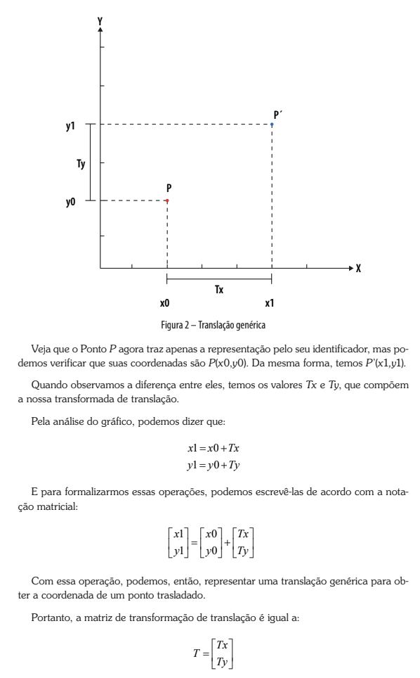

# Computação Gráfica

Exercícios das 4 apostilas da universidade

# Build

```bash
mkdir build
cd build
cmake ..
cmake --build .
```

# Exercício 1 – Translação

## Descrição

Mova um quadrado pela tela usando uma matriz de translação.

## Resultado

Status: Completo



# Exercício 2 – Escala

## Descrição

Aumente e diminua o tamanho de um círculo.

## Resultado

Status: incompleto

# Exercício 3 – Rotação

## Descrição

Rotacione um triângulo em torno do centro

## Resultado

Status: incompleto

# Exercício 4 – Rotação em torno de um ponto arbitrário

## Descrição

Na apostila mostra rotação em torno de A(1,1).

Simule:

- Transladar o objeto para a origem.
- Rotacionar.
- Transladar de volta.

## Resultado

Status: incompleto

# Dependencias

- SFML (https://www.sfml-dev.org/tutorials/3.0/getting-started/macos/)


